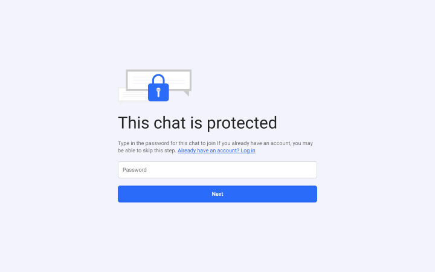

# Welcome to Chat by ConnectNow
Welcome to the Chat user guide docs! These docs will guide you on using ConnectNow as a user.

ConnectNow Chat is a powerful tool allowing you to communicate with fellow team members, customers, or external consultants.

::: tip
Every secure ConnectNow chat URL starts with **https://**. Make sure yours does too to keep your information safe.
:::

## Joining a conversation

If you've been provided with the link and password to a chat running on ConnectNow, you can join the conversation.

1. When prompted, fill in the chat password that was provided to you. If your link already contained the chat password, you will not see this screen. 

2. Fill in your name, surname, and email address. This will be used to identify who you are in the chat, and all chat members will be able to see this. 

If you're logging in to the chat for the first time, you're done. Otherwise, you'll have to complete a quick verification

3. Check your email for an authentication code. When prompted, fill in this authentication code. 

## Leaving a conversation

To leave the conversation, open the [sidebar](#sidebar) on the right side by pressing the "i" icon in the top-right of the navbar. Then, on the sidebar home, scroll to the bottom and choose "Leave chat".

When you leave a conversation, you will still be able to later rejoin by [rejoining a conversation you were previously a part of](#rejoining-a-conversation-you-were-previously-a-part-of). Regardless of whether or not you rejoin, other members of the chat will be able to see that you were a previous participant.

## Inviting people to the conversation

You can invite as many people as allowed on your plan to each chat.

To copy the current chat link, open the sidebar and visit the [People in this chat](#people-in-this-chat) page to copy the link. Then, send this link (along with the chat password that you used) to anyone you'd like to invite.

## Messaging

ConnectNow Chat is a super powerful messaging platform, with all the bells and whistles you'd expect of a modern system.

### Sending text

To send text, use the input bar at the bottom to input your text. To actually send it, you can either press enter, or the "Send" button to the right of the input field. 

### Sending files, images, videos, and more

To send files, select files by clicking on the paperclip icon just to the right of the text input towards the bottom of the screen.

On mobile, you can access your camera and phone album to take pictures (or choose ones you already have on your phone) and send them.

If you are on desktop, you can also drag and drop files onto the chat area to send them.

Depending on the browser you are on, there is native support of PDF files, images, GIFs, videos, and audio files.

## Sidebar

The sidebar serves as a central control panel while you are in a chat. You can open and close it by toggling the "i" icon on the top right to open it, and the "x" icon to then close it.

When you navigate within the sidebar and across sidebar pages, you can always go back by pressing the "back" button in the bottom left corner of the sidebar.

### About this chat

This page shows information about the current chat, including its ID, date of creation, and company it belongs to.

### People in this chat

This sidebar page lists all the people, active or not, that have or currently are part of the chat. You can click on any one of them to see more info about each person.

On this sidebar page, you will see a button at the top that will let you "Share join link". Use this button to copy the chat link to your clipboard, so that you can send it to others as needed.

### Flows

> Coming soon.

### Leave chat

Leave the current conversation. See: [Leaving a conversation](#leaving-a-conversation).

## Install the chat web-app on your devices

You can install the chat web-app onto your phone as it is a modern progressive-web-app.

### On Chrome and Chromium (Android)

You will be prompted by your device to install the app when navigating to it in a Chrome based browser. On a desktop device, including Mac OS devices, you will be prompted to install the application with an icon in the address (URL) bar.

### On iOS

You can save the web-app to your Home screen on iOS. From the website, tap the Share button, then tap Add to Home Screen.