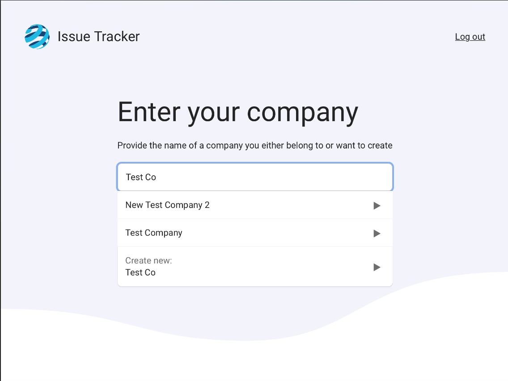
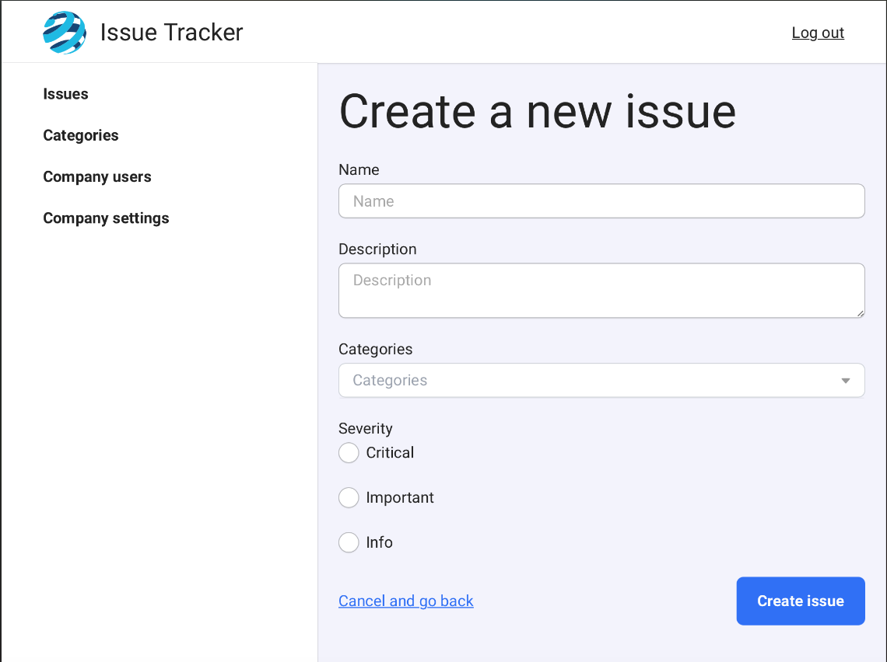

# Welcome to Issue Tracker
Welcome to the Issue Tracker user guide docs! These docs will guide you on using ConnectNow as a user with a registered account.

::: tip
Every secure ConnectNow Issue Tracker URL starts with **https://issuetracker.connectnow.org.uk**. Make sure yours does too to keep your information safe.
:::

## Registering

First, go to <https://issuetracker.connectnow.org.uk/#register>.

Fill in the details asked of you. You will be sent a verification email. Click the button in the email to verify your account and start using Issue Tracker.

After registering, you'll be prompted to [create or choose your company](#creating-a-company).

## Logging in

To log in, go to <https://issuetracker.connectnow.org.uk/#login> and provide your email address and password.

## Resetting your password

To reset your password, go to <https://issuetracker.connectnow.org.uk/#forgot-password>, provide your email address when asked, and follow the on-screen instructions.

## Confirming notification subscriptions

When you or someone signs you up to receive notifications about a specific issue or category, you will be sent only 1 email to confirm you want to indeed get such notifications.

To agree to receive notifications about a given issue or category, click the button in the email within two days.

To no longer receive emails about a given issue, simply ignore the email. Do note, after two days you will not be able to subscribe to the issue again.

## Unsubscribing from notifications

Once you have subscribed to an issue, every subsequent email about the issue (except when the issue is closed) will contain an unsubscribe link at the bottom. 

Click the link at the bottom of the email within two days to stop receiving notifications about the given issue.

## Managing your companies

### Creating a company

When you first register, you will be prompted to select your company. If you see it on the list, select that one. Otherwise, you can create a new company by tapping on the "Create new" option at the bottom.

### Switching your active company

If you are a member of multiple companies, you can easily switch the active one. Just hover over the logo in the navigation bar and a company-switcher will appear.

## Managing issues

### Creating an issue

When you become a member of a company either by being invited or creating your own, you will be able to create issues for that company.

On the sidebar choose 'Issues', then next to 'All issues' choose 'Create new issues'. You'll be able to create your issue here.

Fill in the name of your issue. This should usually be descriptive enough so the issue is immediately clear, but keep it concise.

Next, fill in an initial event description. This is a good place to write "We've discovered the problem, and are working on it" or similar. The description should be relevant to the current point in time - later on you can add events as the issue progresses.

Afterwards, choose a category or categories your issue belongs to. If the category you want doesn't exist, you can create a new one simply by typing the name of the category you want and pressing the Enter key.

Lastly, choose the severity of the issue to further categorize it.

### Adding an issue event

You can add events to an issue as the situation progresses. New issue events will automatically be sent to all subscribers and their webhooks.

To add a new event, find an open issue that you would like to update and click on it. Under 'Events', you will have a input field to enter the new event message. Once you're happy with it, click 'Add event' to add the event to the issue and notify all subscribers.

### Subscribing people to an issue

You can subscribe an email address to any issue. Note that when you subscribe an email address, that email address must confirm their intent to subscribe to the issue (see: [Confirming notification subscriptions](#confirming-notification-subscriptions)).

To add a new subscriber to your issue, find an open issue that you would like to update and click on it. Under 'Subscribe people to issue', enter the email address of the person you wish to subscribe, and press 'Subscribe user'. An invitation to subscribe to the issue will be sent to the email address.

### Closing an issue

When the issue is resolved or deemed closed, you can mark it as such on Issue Tracker.

To close an issue, find an open issue that you would like to update and click on it. Under 'Close issue', write a final event message informing your subscribers of the current state of the issue. When you're happy with your message, tap on 'Close'.

Once you close an issue, you will no longer be able to update it, add events or subscribers, or delete it.

## Issuing API tokens

Issue Tracker is primarily interacted with via its very powerful API. Some endpoints require authorization, which you can do by issuing yourself a token.

If you're unsure of what this section means, contact your developer team.

You can issue API tokens to access Issue Tracker via API. First, [log in](#logging-in). Click on "Create a new token" to create a new token. The token will only be shown once; keep it guarded as you would any other secret.

Head over to the [API docs](../developer-guide/api/) for more info on using the API.

## Revoking API tokens

When you need to revoke an API token, you can do so after logging in to Issue Tracker. Then, on the row of the token you want to revoke, click on "revoke token".

## Managing your subscription plan

You can edit your billing plan, and consequently the features available to you, on your administration page. After logging in, scroll down below the "Tokens" section to change your current plan.